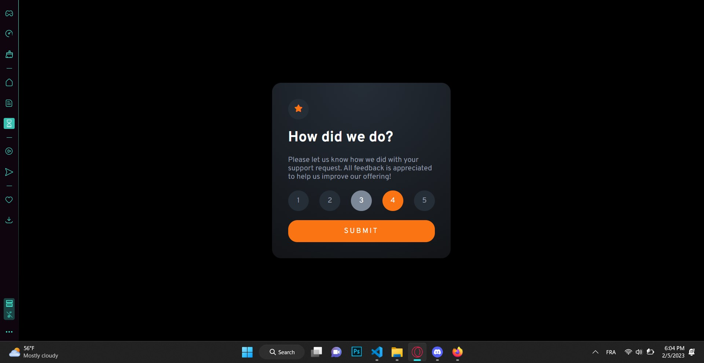
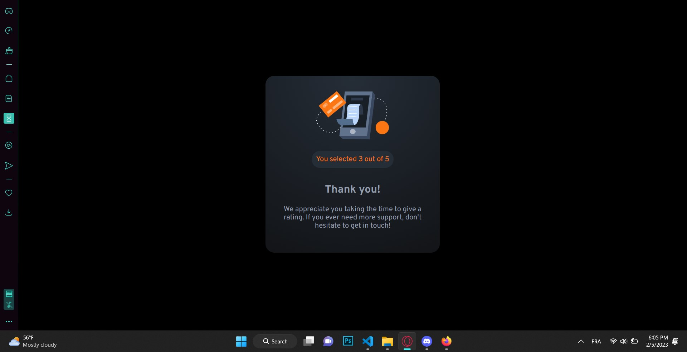

# Frontend Mentor - Interactive rating component solution

This is a solution to the [Interactive rating component challenge on Frontend Mentor](https://www.frontendmentor.io/challenges/interactive-rating-component-koxpeBUmI). Frontend Mentor challenges help you improve your coding skills by building realistic projects.

## Table of contents

- [Overview](#overview)
  - [The challenge](#the-challenge)
  - [Screenshot](#screenshot)
  - [Links](#links)
- [My process](#my-process)
  - [Built with](#built-with)
- [Author](#author)
- [Front-end Style Guide](#front-end-style-guide)
  - [Layout](#layout)
  - [Colors](#colors)
    - [Primary](#primary)
    - [Neutral](#neutral)
  - [Typography](#typography)
    - [Body Copy](#body-copy)
    - [Font](#font)

# Overview

# The challenge

Users should be able to:

- View the optimal layout for the app depending on their device's screen size
- See hover states for all interactive elements on the page
- Select and submit a number rating
- See the "Thank you" card state after submitting a rating

# Screenshot

# Links

- Solution URL: [interactive-rating-component-solution](https://github.com/MuhammedMiiRanna/GDSC-Challenges/tree/main/Interactive%20rating%20component)
- Live Site URL: none

# My process

## Built with

- Semantic HTML5 markup
- CSS custom properties
- Mobile-first workflow

# Author

- Frontend Mentor - [@MuhammedMiiRanna](https://www.frontendmentor.io/profile/MuhammedMiiRanna)

# Front-end Style Guide

## Layout

The designs were created to the following widths:

- Mobile: 375px
- Desktop: > 375px

Responsive web design was used.

## Colors

### Primary

- Orange: hsl(25, 97%, 53%)

### Neutral

- White: hsl(0, 0%, 100%)
- Light Grey: hsl(217, 12%, 63%)
- Medium Grey: hsl(216, 12%, 54%)
- Dark Blue: hsl(213, 19%, 18%)
- Very Dark Blue: hsl(216, 12%, 8%)

## Typography

### Body Copy

- Font size (paragraph): 15px

### Font

- Family: [Overpass](https://fonts.google.com/specimen/Overpass)
- Fallback font: sans-serif
- Weights: 400, 700
