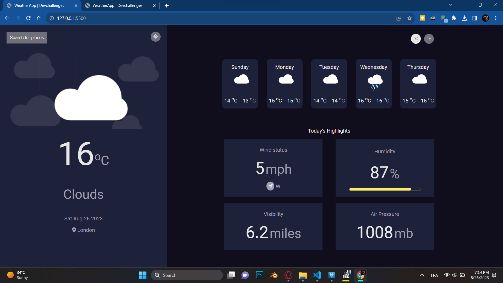
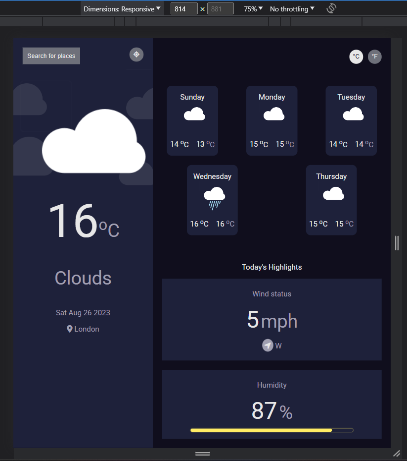
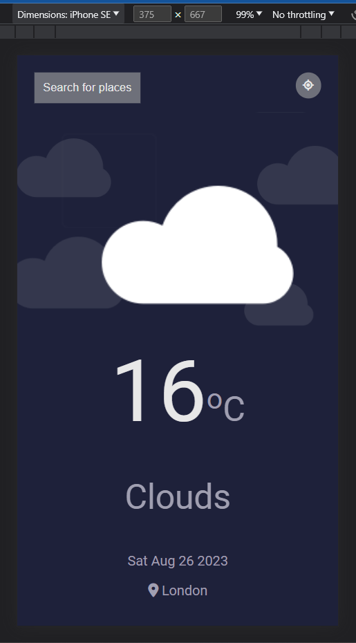
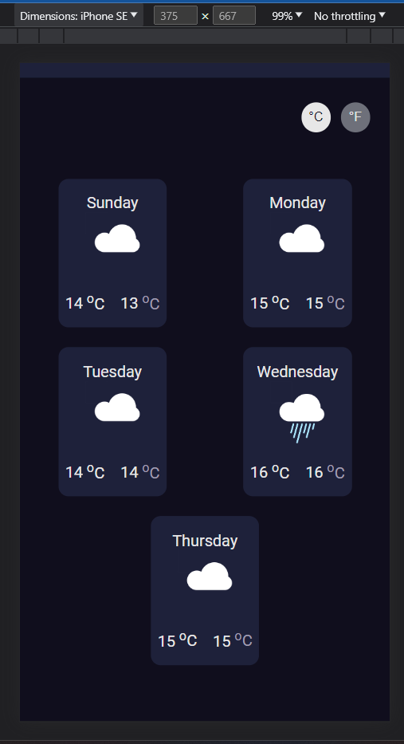
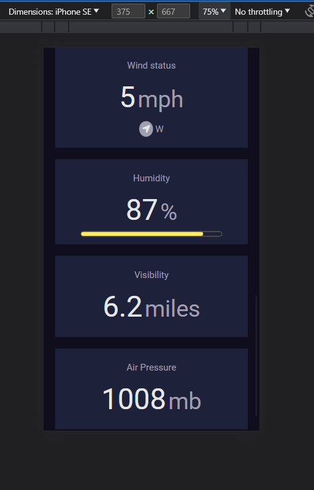
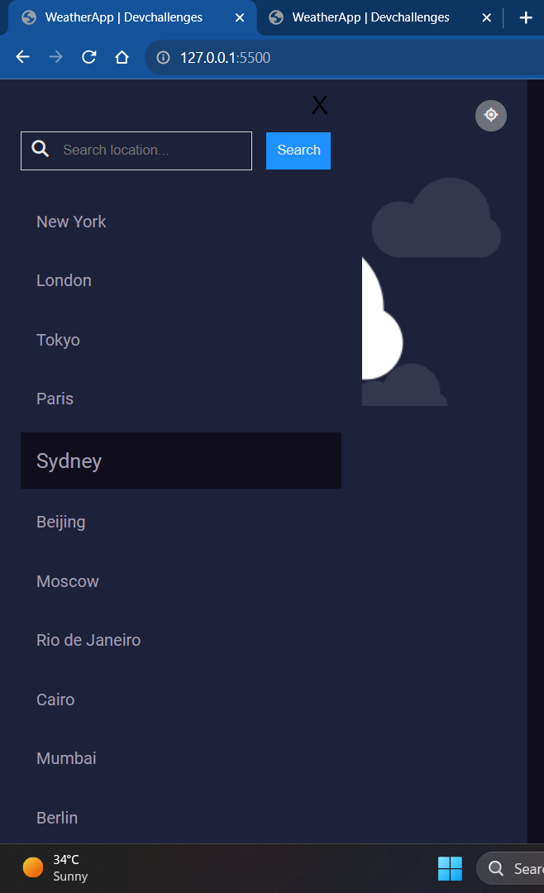
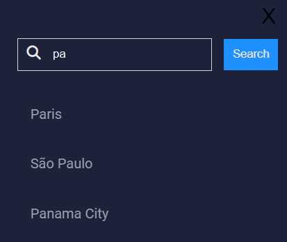

<!-- Please update value in the {}  -->

<h1 align="center">Weather App</h1>

<div align="center">
   Solution for a challenge from  <a href="http://devchallenges.io" target="_blank">Devchallenges.io</a>.
</div>

<div align="center">
  <h3>
    <!-- <a href="https://{your-demo-link.your-domain}">
      Demo
    </a>
    <span> | </span> -->
    <a href="https://github.com/MuhammedMiiRanna/GDSC-Challenges/tree/main/Weather%20app">
      Solution
    </a>
    <span> | </span>
    <a href="https://devchallenges.io/challenges/mM1UIenRhK808W8qmLWv">
      Challenge
    </a>
  </h3>
</div>

<!-- TABLE OF CONTENTS -->

## Table of Contents

- [Overview](#overview)
  - [Built With](#built-with)
- [Features](#features)
- [How to improve?](#how-to-improve?)
- [How to use](#how-to-use)
- [Contact](#contact)
- [Acknowledgements](#acknowledgements)

<!-- OVERVIEW -->

## Overview















### Built With

<!-- This section should list any major frameworks that you built your project using. Here are a few examples.-->

In order to practise the basics more i used:

- Pure CSS
- Vanilla js
- Open Weather Map Api

## Features

<!-- List the features of your application or follow the template. Don't share the figma file here :) -->

This application/site was created as a submission to a [DevChallenges](https://devchallenges.io/challenges) challenge. The [challenge](https://devchallenges.io/challenges/mM1UIenRhK808W8qmLWv) was to build an application to complete the given user stories.

With this App, i can do the following:

    - I can see a default city weather
    - I can request and see my current location weather
    - I can search for a city (among the list of cities, you can add more dynamically)
    - I can see weather of today and the next 4/5 days (api for more then 96 timestamps is paid xD)
    - I can search for a city in the list or by typing some char
    - I can see the date and location of the weather
    - I can see according to image for each type of weather
    - I can see the min and max degree each day
    - I can see wind status and wind direction
    - I can see humidity percentage
    - I can see a visibility indicator (10km is the max)
    - I can see the air pressure number

## How to improve?

- You can add more cities, in the cities.json file
- The layout can be improved
- Can make a functionality to get the nearest city to your current one if not available

## How To Use

<!-- Example: -->

To clone and run this application, you'll need [Git](https://git-scm.com) and [Node.js](https://nodejs.org/en/download/) (which comes with [npm](http://npmjs.com)) installed on your computer. From your command line:

```bash
# Clone this repository
$ git clone https://github.com/MuhammedMiiRanna/GDSC-Challenges/tree/main/Weather%20app

# Install dependencies
$ npm install

# Run the app
$ npm start
```

## Acknowledgements

<!-- This section should list any articles or add-ons/plugins that helps you to complete the project. This is optional but it will help you in the future. For example: -->

- [Open Weather Map Api](https://openweathermap.org/api)
- [fontawesome](https://fontawesome.com/)

## Contact

- LinkedIn [Mohamed Ali Merali](https://{https://www.linkedin.com/in/mohamed-ali-merali-605631138/})
- GitHub [@MuhammedMiiRanna](https://github.com/MuhammedMiiRanna)
